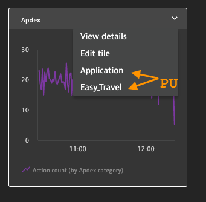
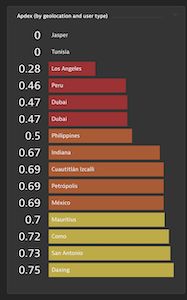
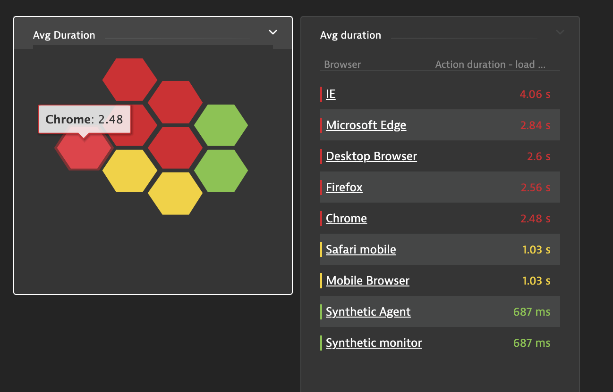
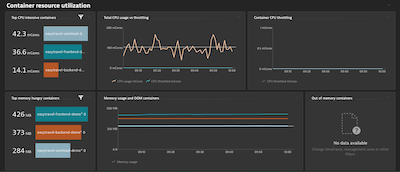

# Dynatrace Dashboard Powerups

This extension powers-up Dynatrace dashboards to enable cool new experimental features live, such as:
- Color changing tiles based on thresholds
- Color changing icons based on thresholds
- Tooltips on charts
- USQL values on world maps
   
*Please note: this is a community developed demonstration application. It is provided without any representations, warranties, or support from Dynatrace. If you have questions about this app, please post on our forum or create an [issue](https://github.com/LucasHocker/DynatraceDashboardPowerups/issues) on Github*

## Table of contents
- [Install](#Installation)
- [Configure](#Configure-extension)
- Powerup List:
    - [Disclaimer](#Disclaimer)
    - [Tooltips](#Tooltips)
    - [Colorize](#Colorize)
    - [Icons](#Icons)
    - [Worldmaps](#Worldmaps)
    - [Banner](#Banner)
    - [Line chart threshold](#Line-chart-threshold)
    - [USQL stacked bar chart](#USQL-Stacked-Bar-chart)
    - [USQL colors](#USQL-colors)
    - [Heatmap](#heatmap)
    - [Sankey](#UserAction-Sankey-chart)
    - [Vertical funnel](#Vertical-Funnel)
    - [Math](#Math)
    - [Date](#Date)
    - [Gauge](#Gauge)
    - [Compare](#Compare)
    - [VLookup](#VLookup)
    - [Stdev](#Stdev)
    - [100stack](#100stack)
    - [mCompare](#mCompare)
    - [Image](#Image)
    - [Background](#Background)
    - [Funnelcolors](#FunnelColors)
    - [Forecast](#Forecast)
    - [Grid](#Grid)
    - [TileCSS](#Tilecss)
    - [Menu](#Menu)
    - [Topcolor](#Topcolor)
    - [Honeycomb](#Honeycomb)
    - [Autohide](#Autohide)

## Installation
1. Install the extension from the
[Chrome Store](https://chrome.google.com/webstore/detail/dynatrace-dashboard-power/dmpgdhbpdodhddciokonbahhbpaalmco)


2. Click the puzzle icon and pin Powerups


3. The icon will change from gray to blue when active (and purple when the extension has updated)


4. When a new update is released via Chrome Web Store it will automatically be updated. Google can take several days to approve an update to an Extension. If you wish to run the very latest version, change Library Location to GitHub in the Extension preferences.

## Configure extension
5. Click blue (or purple) powerup icon


6. Modify preferences


7. Click save. Note: you may need to refresh your page for changes to take effect.

## Powerup Howto
To add Powerups to your existing dashboards, you may add markup text in your dashboard tile titles. Alternatively, you may deploy dashboard packs with Powerups already included via the <a href="https://dynatrace.github.io/BizOpsConfigurator">BizOpsConfigurator</a>.

## Powerup List


### Disclaimer
If you manually add markup, it is best practice to add a Powerup disclaimer tile so that users who do not yet have the Extension, will be directed to install it. To add the disclaimer, add the following to your dashboard JSON:
```
{
    "name": "Markdown",
    "tileType": "MARKDOWN",
    "configured": true,
    "bounds": {
        "top": 0,
        "left": 0,
        "width": 1254,
        "height": 76
    },
    "tileFilter": {},
    "markdown": "##\uD83D\uDC8E Powerup Enabled Dashboard \uD83D\uDC8E\n\n##  [Install Chrome Extension](https://chrome.google.com/webstore/detail/dynatrace-dashboard-power/dmpgdhbpdodhddciokonbahhbpaalmco)"
}
```
If you deploy dashboard packs from the BizOpsConfigurator, this tile is already added for you. Once the Extension loads this tile is hidden.

### Tooltips
Nothing required, just enable the extension as per above and refresh your browser on a dashboard.

Example:


### Colorize
For Single Value Tiles, either custom chart or USQL, you can add color coding by adding markup to the title:
`!PU(color):base=high;warn=90;crit=80`. Note: also see [USQL colors](#USQL-colors) PowerUp for simply changing colors for USQL and Explorer tiles.

Explanation:
- `!PU(color):` this starts the markup
- `base=high` this is the base case for your metric, ie is it good to be `low` or `high`?
- `warn=90` this is the warning threshold, once breached color coding will be yellow
- `crit=80` this is the critical threshold, once breached color coding will be red
- `nan=orange` (optional) change color if no data is found or null
So in the example of availability, high is better. Greater than 90 would be green, 90 to 80 yellow, and 80 or less red.

Alternative: Absolute value comparison
- `base=abs,1`
- `warn=0.05`
- `crit=0.1`
This example would result in red: <= .9 or >= 1.1, yellow: <=.95 or >= 1.05, green otherwise.

Example:


### Icons
This powerup renders icons in place of Markdown tiles. These icons change color to give a quick visual indication of environment / business health. For example, if payment processing was beyond a threshold hold, you might have a creditcard icon turn red. Here's how that might look:
```
[Extension Needed](https://github.com/LucasHocker/DynatraceDashboardPowerups)
!PU(svg):icon=creditcard;link=val3;base=high;warn=90;crit=85
```

Explanation:
- Link to extension: this lets users without the extension know to download it
- `!PU(svg):` this starts the markup
- `icon=` this refers to an SVG file in the 3rdParty/node_modules/@dynatrace/barista-icons folder. (Optional) you can use a comma-seperated list of 3 icons if you want the icon shape to change based on the value, e.g. `icon=smiley-happy-1,smiley-ok-2,smiley-unhappy-2`
- `link=` this is used to link to a Single Value Tile to get the comparison value
- `base=` this is the base case for your metric, ie is it good to be low or high?
- `warn=` this is the warning threshold, once breached color coding will be yellow
- `crit=` this is the critical threshold, once breached color coding will be red
- `tooltip=` tooltip text for the icon. Use underscores in place of spaces, they'll be swapped for spaces.
- `url=` (optional) if you want the icon to be clickable, give it a url. REQUIRED: use this as last argument.
Just be sure to include the `!PU(link):` with a matching string in the desired Single Value Tile

Example:


### Worldmaps
This powerup reloads the data in world maps with that from a USQL table. This allows you to map arbitrary things like revenue. It also enables click or scrollwheel to zoom. Click in an ocean to reset zoom. Add markup to your USQL table's title like this:
`Revenue !PU(map):color=green;link=Apdex`

Explanation:
- Revenue: title for your USQL table and Worldmap
- `!PU(map):` indicates this is a map powerup
- `color=` what color scale to use, e.g. "green" or "#E9422F"
- `link=` refers to the standard metric picked for the chart in the OOTB tile configuration. This allows you to have multiple worldmaps driven by multiple USQL tables

Example:


### Banner
If you have multiple environment with dashboards up on screens and need an easy way of telling which is say Production and which one is say QA, you can color code the top of the dashboard. Use a ~~dashboard tag~~ markdown tile like this:
`!PU(banner):color=purple`

> ⚠️ DEPRECATION NOTICE: Using dashboard tags for the Banner PowerUp is deprecated and replaced by Markdown tiles. Please update your dashboards as of 1.49. Targeting 1.51 for removal.

Explanation:
- `!PU(banner):` indicates a banner powerup
- `color=` what color background to make the banner, e.g. "purple" or "#B6E5F8"

Example:


### Line chart threshold
If you would like a chart that shows as one color above a threshold but a different color below, this powerup enables that. Add markup to to the chart title like so:
`!PU(line):thld=4000;hcol=green;lcol=red`

Explanation:
- `!PU(line):` indicates this linechart should have a threshold
- `thld=4000;` the threshold (Note: does not currently support units)
- `hcol=green;` the color above the threshold
- `lcol=red` the color below

Example:


### USQL Stacked Bar chart
This powerup switches to a stacked bar chart for a USQL result instead of stacked xaxis labels. Change the title like this:
`!PU(usqlstack):colors=green,blue,#aabbcc`

Explanation:
- `!PU(usqlstack):` - indicates the powerup
- `vals=` - (optional) align colors to specific values
- `colors=green,blue,#aabbcc` - assigns colors to each series
- `dataLabels=true` - (optional) display data label on each segment, defaults to no

Example:


### USQL colors
This powerup switches the color palette for a USQL or Explorer chart. Change the title like this:
`!PU(usqlcolor):vals=satisfied,tolerating,frustrated;colors=green,yellow,red`

Explanation:
- `!PU(usqlcolor):` - indicates the powerup
- `vals=` - (optional) align colors to specific values
- `colors=green,blue,#aabbcc` - assigns colors to each series
- `dataLabels=true` - (optional) display data label on each segment, defaults to no

Example:


### Heatmap
Currently this powerup can display a heatmap based on a **bar chart**. Eventually, it will be more generic.
```
Apdex !PU(heatmap):vals=.5,.7,.85,.94;names=Unacceptable,Poor,Fair,Good,Excellent;colors=#dc172a,#ef651f,#ffe11c,#6bcb8b,#2ab06f
```
```
Request Count !PU(heatmap):minColor=yellow;maxColor=green;txtColor=black;ms=3600000;fmt=HH:mm
```

Explanation:
- `!PU(heatmap):` - denotes the heatmap powerup, anything prior to this is treated as the title
- `txtColor=` - (optional) what color text to use for data labels, defaults to white
- `ms=` - (optional) number of milliseconds to bucket time by on x-axis, e.g.:
- - `86400000` - 1 day (default)
- - `3600000` - 1 hour
- `fmt=` - (optional) date format for x-axis, see [date-fns](https://date-fns.org/v1.9.0/docs/format)
- `scale=` - (optional) multiply values by this number, defaults to 1. Affects display and `vals`. e.g.:
- - `.000001` -  bytes into gb

&nbsp;&nbsp; Option 1 - Color classes:
- `vals=` - thresholds, should be N-1 of them
- `names=` - names for each area on the color axis, should be N of them
- `colors=` - CSS colors, should be N of them

&nbsp;&nbsp; Option 2 - Color gradient:
- `min=` & `max=` - (optional) min and max values for color axis, defaults to extreme values in the dataset
- `minColor` & `maxColor` - (optional) min and max colors, colors will be interpolated between these, defaults to white and blue

Examples:


### UserAction Sankey chart
This powerup shows UserActions for your application, where they start, end, how many, do users circle in loops, etc. Create a USQL query, like this:
```
select useraction.*, usersession.* FROM usersession WHERE useraction.application="www.angular.easytravel.com" 
```

encoded with a title like this:
```
Angular Easy Travel UserJourneys !PU(sankey):link=sankey1;kpi=revenue;kpicurr=EUR
```

and Markdown tile to get swapped out like this:
```
[Extension Needed](https://github.com/LucasHocker/DynatraceDashboardPowerups)
!PU(link):sankey1
```

Explanation:
- `!PU(sankey):` - denotes the powerup source
- `link=` - points to markdown tile via the link powerup
- `kpi=` - (optional) the name of a User Action Property to be displayed in the main tooltip, usually something like revenue
- `kpicurr=` - (optional) how to format the KPI if its a currency, e.g. USD, EUR, CNY. If omitted, will format with max 2 fractional digits
<!--- `convHack=true` - (optional) label first action with "Start: " and last action with "End: ".
- `convHack=2` - (optional) new mode which injects an artificial "START" and "END" node to make it more clear where flows start and end. As of 1.44 this is now the default. If you prefer the old mode, set `convHack=false`.-->
- `colors=apdex` - (optional) set default color mode to apdex. As of 1.44 this is now the default. 
    - `colors=false` - rainbow colors, which makes it easier to see links.
    - `colors=errors` - highlight actions with errors, yellow > 1 error, red > 10
    - `colors=crashes` - highlight actions leading to a crash (mobile/custom only)
- `exclude=Search,recent` - (optional) comma seperated list of case-sensitive strings to hide from useraction list. Note: where possible it is recommended to limit via the USQL where clause instead to provide more meaningful data.
- `include=Search,recent` - (optional) comma seperated list of case-sensitive strings to only include from useraction list, all others will be hidden. Note: where possible it is recommended to limit via the USQL where clause instead to provide more meaningful data.
- `limit=20` - (optional) default amount of action to action links to show in the chart, defaults to 20. Valid values are integers from 2 to 100.
- `flink=` - (optional) points to a markdown tile via the link powerup. After the `!PU(link):something`, on a seperate line include the JSON-encoded filter list in the markdown. You can get this by clicking the down arrow to the right of color mode.

Example:


Notes:
- To increase/decrease the amount of clutter, use the plus and minus buttons. These slice the data in the USQL query.
- To get even more data from the USQL query, edit the dashboard JSON and add to the USQL tile (default 50, max 5000, more can result in slower load):
`"limit": 500`
- Be sure to click on useraction "nodes" in the graph for additional details and drilldowns into user sessions

### Vertical Funnel
This powerup changes the Dynatrace horizontal funnel into a vertical funnel. To utilize encode your title like so:
`Angular UserJourney !PU(funnel):mode=height;small=5;big=20;links=funnelinks`

Explanation:
- `mode=height` - which type of funnel visualization, options are `height`, `slope`, `bar`
- `small=` - minimum percentage to treat as a small positive or negative change, ie gray below this and light green/red above
- `big=` - minimum percentage to treat as a big positive or negative change, ie bold green/red above this
- `links=` - link to markdown tile with drilldown urls

Example:
 

### Math
This powerup allows you to do complex math based on other values on the dashboard. See [math-expression-evaluator](http://bugwheels94.github.io/math-expression-evaluator/#supported-maths-symbols) for help with math expressions. 

Syntax:
`!PU(math):exp=(x1+x2+x3+x4)/4;scope=x1,x2,x3,x4:link4;color=blue`

Explanation:
- `!PU(math):` - denotes a math powerup
- `exp=` - a math expression
**Note: be sure to escape `*` by adding a backslash in front of it**
- `scope=` - list of any variables used in your expression. Optionally, you may have seperate variable names from link name, e.g. `x4:link4`, otherwise assume var and link are the same string e.g. `x1`
- `color=` - (optional) a valid CSS color, defaults to white
- `size=` - (optional) a valid CSS font-size, defaults to 36px
- `base=` - (optional) if using thresholds, define whether the base (normal) is `low` or `high`
- `warn=` - (optional) if using thresholds, warning threshold, once breached color coding will be yellow
- `crit=` - (optional) if using thresholds, critical threshold, once breached color coding will be red
- `dates=true` - (optional) use if special date math logic is needed
- `timeunit=` - (optional) units if doing date math: `s` for seconds, `m`, `h`, `d`. Defaults to `ms` for milliseconds.
- `full=false` - (optional) by default take up the full tile. Optionally, `false` to not hide other text in markdown tile. Must be false to support multiple math powerups in a single tile.
- `currency=` - (optional) display according to an ISO currency code, e.g. `USD`, `EUR`, `CNY`, etc

Example:


Note:
- If you encounter issues with dissimilar units, change the units in the chart


### Date
This powerup allows you to use Dynatrace date format strings and format in Markdown tiles. 

Syntax:
`!PU(date):res=now-7d/d;fmt=YYYY-MM-DD;color=green`

Explanation:
- `!PU(date):` - denotes the date powerup
- `res=` - resolve this date string, click on global time selector for help with syntax
- `fmt=` - display format, see [date-fns](https://date-fns.org/v1.9.0/docs/format)
- `color=` - a valid CSS color

Example:


### Gauge
This powerup converts a Single Value Tile into a solid gauge. 

Syntax:
`Memory !PU(gauge):stops=.5,.75,.9;colors=green,yellow,orange,red;min=0;max=100`

Explanation:
- `!PU(gauge):` - denotes the gauge powerup
- `stops=` - color stops as a percentage of the max, valid values rante 0 through 1
- `colors=` - colors for color stops. You should have an equal number of colors and stops.
- `min=` - left end of the gauge, defaults to 0
- `max=` - right end of the gauage, defaults to 100
- `digits=2` - digits after the decimal, defaults to 1

Example:


### Compare
This powerup compares a Single Value Tile (SVT) to another SVT and applies coloring based on the comparison. 

Syntax:
`Active users !PU(compare):link=link2;lt=red;gt=green;eq=yellow !PU(link):link1`

Explanation:
- `!PU(compare):` - denotes the compare powerup
- `link=link2` - references another SVT to compare against
- `lt=red` - a color if this SVT is less than the other
- `gt=green` - a color if this SVT is greater than the other
- `eq=yellow` - a color if this SVT is equal to the other
- `!PU(link):link1` - this is a reference back from the other SVT which is also using !PU(compare)

Example:


### VLookup
This powerup extracts a value from a USQL table, and optionally compares it to another table value.

Syntax:
`!PU(vlookup):link=table;val=/easytravel/rest/journeys/;col=1;compareTable=table;compareVal=/easytravel/rest/locations;compareCol=1;lt=green;gt=red;eq=yellow`

Explanation:
- `!PU(vlookup):` - denotes this powerup
- `link=table` - reference the table tile, ie put `!PU(link):table` in the title of the USQL tile
- `val=...` - value to look for in the first column of the table
- `col=1` - column number (or name) of where to look up the value, ie 1 is 2nd column of the table

Options:
- `color=blue` - what color to make the text
- `row=1` - ignore val and instead lookup value by row number. Starting at 1 from top or -1 from bottom.
- `notfound=0` - if value isn't found, instead use this value. Defaults to blank. Consider setting to zero if math tiles depend on this tile.
- `size=14px` - optionally change size of text, defaults to 36px.

Optional comparison:
- `compareTable=table` - reference the table tile, ie put `!PU(link):table` in the title of the USQL tile
- `compareVal=...` - value to look for in the first column of the table
- `compareCol=1` - column number (or name) of where to look up the value, ie 1 is 2nd column of the table
- `lt=green` - color to make the text, if the value is lower than the comparison value
- `eq=yellow` - color to make the text, if the value is equal than the comparison value
- `gt=red` - color to make the text, if the value is greater than the comparison value

Optional thresholds, mutually exclusive of comparison:
- `base=high` this is the base case for your metric, ie is it good to be low or high?
- `warn=90` this is the warning threshold, once breached color coding will be yellow
- `crit=80` this is the critical threshold, once breached color coding will be red

Example:


### Stdev
This powerup computes standard deviation (or other value) over a series. Apply to a USQL table.

Syntax:
`!PU(stdev):color=orange;output=min,avg,median,90%,max,sum,stdev`

Explanation:
- `!PU(stdev):` - denotes this powerup
- `output=min,avg,median,90%,max,sum,stdev` - which function(s) to output, defaults to stdev
- `color=orange` - what color to make the text, defaults to white

Example:


### 100 Stack
This powerup switches stacked column charts to 100% stacked charts.

Syntax:
`!PU(100stack):pad=0.1`

Explanation
- `!PU(100stack):` - denotes this powerup
- `pad=0.1` - (optional) override standard padding between points. Note: small padding can lead to uneven looking spacing due to pixel rounding from antialiasing -- use a larger graph to avoid.

Example:


### Table
This powerup enables exporting USQL tables to CSV/XLS and sortable columns.

Syntax:
`!PU(table):`

Explanation:
- `!PU(table):` - denotes this powerup
- `col=` - (optional) default sort order, e.g. 1 sort by first column ascending, -5 sort by fifth column descending

Example: 


### Background
This powerup changes the background of the dashdoard to an external image. This should be placed in an offscreen markdown tile. The tile will auto-hide when the extension runs.

Syntax:
`!PU(background):url=https://myurl.com/myimage.png`

Explanation:
- `!PU(background):` - denotes this powerup
- `url=` - url of the image to load

Note: you should limit usage to only trusted image sources and keep file size reasonable

### Image
This powerup adds an external image. This swaps a markdown tile with the image.

Syntax:
`!PU(background):url=https://myurl.com/myimage.png out=https://www.dynatrace.com`

Explanation
- `!PU(background):` - denotes this powerup
- `url=` - url of the image to load
- `out=` - (optional) makes image a clickable link. Where should the link go. Also note the space delimiter.

Note: you should limit usage to only trusted image sources and keep file size reasonable

### mCompare
This powerup compares multiple SVTs. It has two modes: `outlier` and `scale`. Outlier mode highlights the low and high; whereas, scale uses color to show distance from extremes.

Syntax:
- `!PU(mcompare):links=link1,link2,link3,link4,link5;low=green;high=red;other=gray !PU(link):link1`
- `!PU(mcompare):mode=scale;links=linkA,linkB,linkC,linkD,linkE;low=blue;high=green !PU(link):linkA`

Explanation:
- `!PU(mcompare):` - denotes this powerup
- `mode=scale` - which mode, defaults to `outlier`
- `links=` - list of links to SVTs
- `low=` - CSS color for lowest value
- `high=` - CSS color for highest value
- `other=` - CSS color for middle values in outlier mode

Example: 


### FunnelColors
This powerup retains the existing funnel design but allows changing the colors. You can either specify `colors` directly or specify a `scale` between two colors.

Syntax:
- `!PU(funnelcolors):colors=#9cd575,#4fd5e0,#2ab6f4,#a972cc`
- `!PU(funnelcolors):scale=#14a8f5,#6bcb8b`

Explanation:
- `!PU(funnelcolors):` - denotes this powerup
- `colors=` - specify colors for each funnel step from left to right
- `scale=` - specify a color scale starting with the first color and ending with the last

Example:


### Forecast
This powerup provides basic statistical tools to analyze **one line chart**. Additionally, you can also forecast future values based on these tools.

Syntax:
- `Revenue !PU(forecast):n=20%;p=30%` - project revenue forward 30% of the graph, using a 20% sliding window
- `VisuallyComplete !PU(forecast):analysis=EMA,Linear` - apply EMA and Linear regression to Visually complete

Explanation:
- `!PU(forecast):` - denotes this powerup
- `n=20%` - how many data points to use for sliding windows. Can either be integer values for specific number of data point or percentage for a portion of the current data points. Defaults to 20%.
- `p=20%` - how many data point to project into the future. Integer values for specific number of points or percentage to base on chart size. Defaults to 0.
- `analysis=Linear` - Analyses to default to on:
    - `SMA` - Simple Moving Average based on an `n` sized moving window
    - `EMA` - Exponential Moving Average based on an `n` sized moving window, includes 1 standard deviation range also based on `n`
    - `Mean` - Determines the average or mean across the timeseries also showing 1 standard devation for the timeseries
    - `Linear` - Linear regression of the timeseries
    - `Projection` - (on by default if `p` > 0) Projects the Linear Regression `p` points into the future. Additionally, linear regressions are performed on +/- 1 standard deviation.
- `colors=#2ab6f4,#4fd5e0,#748cff,#4fd5e0,#fd8232` - colors to use for analysis series.

Example:


### Grid
Add grid lines to your dashboards.

Syntax:
- `!PU(grid):hor=0,9,18;ver=0,9,18,27,35;color=#454646`

Explanation:
- `!PU(grid):` - denotes the powerup
- `hor=0,9,18` - draw horizontal lines at the 0th, 9th, and 18th blocks on the dashboard. Blocks are 38px apart.
- `ver=0,9,18,27,35` - draw vertical lines at various blocks
- `color=` - (optional) css color to use for the grid, defaults to `#454646`
- `wid=38` - (optional) width of the lines in px, defaults to 38
- `margin=4` - (optional) margin in px to swallow up by the lines, defaults to 4. Ie default lines will be 46px wide (4 + 38 + 4)

Example:


### TileCSS
Use CSS directives to further style a tile. Note: First version is somewhat limited; further enhancements will be made to select different parts of the tile.

Syntax:
- ``Revenue !PU(tilecss):`border:3px green solid;border-radius: 15px;transform: rotateZ(45deg);` ``

Explanation:
- `!PU(tilecss):` - denotes the powerup
- `` `...` `` - css directives wrapped in backticks. `url()` is disallowed.

Example:


### Menu
Add additional context menu items. Requires Dynatrace >= 1.214.

Syntax:
- `Apdex !PU(menu):name=Application;url=#uemapplications/uemappmetrics;uemapplicationId=APPLICATION-008569CDB300AE03 !PU(menu):name=Easy_Travel;url=http://www.easytravel.com`

Explanation:
- `!PU(menu):` - denotes the powerup
- `name=` - what text to put in the menu (do not use spaces)
- `url=` - URL to link to. Note: Absolute URLs (ie starts with `http`) will open in a new tab.

Example:


### Topcolor
Apply coloring to toplists. Note: where possible please use Explorer tiles instead of this PowerUp. Explorer tiles should support sorting in a few sprints (~1.220).

Syntax:
- `Worst Apdex by Geo !PU(topcolor):vals=.5,.7,.85,.94;colors=#dc172a,#ef651f,#ffe11c,#6bcb8b,#2ab06f`

Explanation:
- `!PU(topcolor):` - denotes this powerup
- `vals=` - thresholds, should be N-1 of them
- `colors=` - CSS colors, should be N of them

Example:


### Honeycomb
Transform an Explorer tile table into honeycombs. Color coding should be done in Explorer.

Syntax:
- `CPU Usage !PU(honeycomb):`

Explanation:
- `!PU(honeycomb):` - denotes this powerup
- `links=link1,link2` - merge data from other Explorer table tiles. NOTE: columns must match.
- `drill=#uemapplications/performanceanalysis;uemapplicationId=...filtr3sProp0-=$colname%20s$name` - override drilldown url. `$colname` is replaced by the column name, `$name` by the name in the first column, and `$value` by the value of the row.

Example:


### Autohide
Automatically hide a tile's content if there's no data.

Syntax:
- `Out of memory containers !PU(autohide):`

Explanation:
- `!PU(autohide):` - denotes this powerup

Example:

